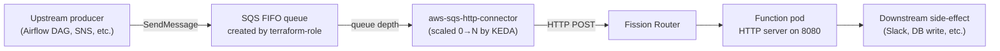
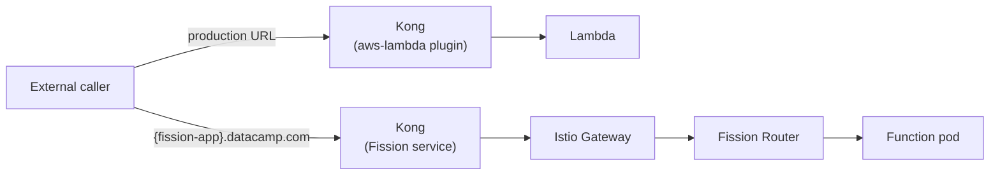

# Migrating Serverless Framework Applications to Fission

## Context

Fission is a serverless platform that runs functions as containers on Kubernetes. Functions are packaged as container images and invoked through HTTP requests sent to a configured container port. Regardless of the trigger type, all invocations are delivered to the function as HTTP requests.

This differs from AWS Lambda's execution model. Lambda functions receive events directly from the runtime, whereas Fission functions run as long-lived containers and must expose an HTTP endpoint. Applications migrated to Fission must therefore provide an HTTP listener on the configured `container_port`. A Fission Function has a one-to-one relationship with a handler and its container image.

Fission supports the following trigger types:

- **MessageQueueTrigger**
  - A connector component consumes messages from SQS and forwards them to the target function via HTTP.

- **HTTPTrigger**
  - Requests are routed through Istio to the Fission Router, which forwards them to the target function.

- **TimeTrigger**
  - The Fission timer component invokes the function according to the configured schedule.

## Usage

The migration process begins by onboarding a new Fission application. The onboarding workflow is identical across all trigger types. During the migration, the existing Serverless Framework application deployed via `serverless-role` and the new Fission application deployed via [fission-role](https://github.com/datacamp-engineering/fission-role) run in parallel until the migration is completed.

1. Select the **Fission App Onboarder** [template](https://engineering-portal.us-east-1.internal.datacamp.com/create/templates/default/fission-app-onboarder) from Engineering Portal .
2. Complete the required configuration fields and submit the template.

### What the onboarder creates

The onboarder produces two repositories. Their contents differ only in the trigger-specific blocks; everything else is identical across trigger families.

**`<app>` — code repo.**:

- `Dockerfile` — To create a docker image from the app to be pushed to Artifactory. The image runs the handler as an HTTP server.
- `.circleci/config.yml` — builds and pushes the container image to Artifactory.

**`<app>-infra` — infra repo.** The deployment glue:

- `deploy.yml` — Deployment configuration containing environment-specific Fission settings
- `fission.yml` — Fission resource definitions, including the Function and trigger configuration. HTTPTrigger / MessageQueueTrigger / TimeTrigger pass-through
- `pipeline.yml` — Concourse promotion pipeline
- `environments/{common,staging,prod}/` — Terraform structure for AWS resources required by the application.
- `kong.yml` — HTTP-triggered applications only. Defines the Kong service, route, and associated plugins.

## MessageQueueTrigger migration (SQS Lambdas)

This migration path applies to applications that are currently triggered through SQS Event Source Mappings (ESM). Under Fission, the SQS queue is polled by a connector component that forwards messages to the function over HTTP.

### Phase 1 — Infra repo

Add required terraform module to create SQS resources in the related terraform files in `<app>-infra/environments/`.
For this phase, keep the `deploy.yml` runlist limited to `terraform-role`. Leave the `queueURL` field in `prod.fission.trigger.mq.metadata.queueURL` set to `REPLACE_WITH_PROD_SQS_QUEUE_URL`; the actual queue URL will be populated once the queue has been created.
After the PR is merged, Concourse runs `terraform-role` and provisions the SQS resources in the target AWS account.

### Phase 2 — Code repo

What lands in the code-repo PR:

- `handler.js` — Migrate the existing business logic from the legacy application.
- `server.js` — Add an HTTP server (for example, Express or Koa) that listens on the configured port and forwards incoming requests to the handler.
- `Dockerfile` — Build a container image that starts the HTTP server and exposes the function through an HTTP endpoint.

The repository should also include a README with local development and testing instructions.

After the PR is merged, CircleCI builds the container image and publishes it to Artifactory, making it available for deployment by fission-role.

### Phase 3 — Infra repo

This phase deploys the application to Fission and can only be performed after the container image has been successfully published to Artifactory.

The PR should include the following changes:

- Add `fission-role` to the runlist: `runlist: "terraform-role,fission-role"`
- Replace the `REPLACE_WITH_PROD_SQS_QUEUE_URL` placeholder in `prod.fission.trigger.mq.metadata.queueURL` with the actual SQS queue URL created in Phase 1.
- Review `deploy.yml` and add any environment-specific overrides required in addition to the defaults defined in `fission.yml`.

After the PR is merged, Concourse runs terraform-role and fission-role, deploying the Fission Function and configuring the SQS trigger. The function is now live and ready to receive messages from the SQS queue, but the legacy Lambda is still active and receiving traffic at this point.

### Phase 4 — Validation

Once the application has been deployed, validate the end-to-end message flow by sending a test message to the newly created SQS queue and confirming that it is processed successfully by the Fission function.
The request flow for a MessageQueueTrigger application is illustrated below:



### Phase 5 — Cutover

Once the Fission application has been validated, traffic can be fully transitioned to the new deployment. The legacy Serverless Framework deployment can then be decommissioned.

## HTTPTrigger migration

This migration path applies to applications currently exposed through Kong using the `aws-lambda` plugin. During the migration, a new Fission application runs in parallel alongside the existing Lambda deployment. The Lambda route in Kong remains unchanged until the Fission function is validated and ready for cutover.

### Phase 1 — Code repo

This phase is identical to Phase 2 of the MessageQueueTrigger migration. The application is updated to run as a containerized HTTP service that can be deployed on Fission.

The PR should include:

- The function handler migrated from the existing application.
- An HTTP server that exposes the handler through a configurable port.
- The required application dependencies.
- A Dockerfile to build the container image.

### Phase 2 — Fission onboarding

Use the **Fission App Onboarder** [template](https://engineering-portal.us-east-1.internal.datacamp.com/create/templates/default/fission-app-onboarder) in Engineering Portal to scaffold two new repositories: `{fission-app}` (code repo) and `{fission-app}-infra` (infra repo). The onboarder sets the runlist to `terraform-role,fission-role,kong-deck-role` and scaffolds `{fission-app}-infra/kong.yml` with a service and route scoped to `{fission-app}.${DECK_EXTERNAL_ZONE}` — a dedicated validation endpoint, not the Lambda's production URL.

Review the generated files before merging:

- Review `{fission-app}-infra/kong.yml` and update for any application-specific requirements. Do not change the `hosts` list — the Fission app keeps its own dedicated endpoint throughout Phases 3 and 4.
- Add any required Terraform resources under `{fission-app}-infra/environments/`.
- Review `deploy.yml` and add environment-specific overrides beyond the defaults in `fission.yml`.

### Phase 3 — Deploy Fission alongside Lambda

Merge the `{fission-app}-infra` PR. Concourse runs `terraform-role`, `fission-role`, and `kong-deck-role` in sequence:

- `fission-role` deploys the Fission Function, HTTPTrigger CRD, Istio Gateway, VirtualService, Route53 CNAME, and TLS certificate.
- `kong-deck-role` creates the Fission service and route in Kong, scoped to `{fission-app}.${DECK_EXTERNAL_ZONE}`.

The existing Lambda infra repo (`{lambda-app}-infra`) is not modified. Kong still routes the production URL through the `aws-lambda` plugin to Lambda.

After this phase, both stacks are live simultaneously:



### Phase 4 — Validation

Lambda handles 100% of production traffic. The Fission function is reachable at its own HTTPTrigger endpoint — derived from `trigger.http.spec.ingressconfig.host` in `{fission-app}-infra/fission.yml`:

```text
https://{fission-app}.{DECK_EXTERNAL_ZONE}
```

Validate by sending representative requests to that endpoint and comparing response correctness, latency p99, and downstream side-effects against the Lambda baseline.

### Phase 5 — Decommission

Use the **Retire** option in Engineering Portal for the Lambda component to decommission the legacy deployment.

## TimeTrigger migration

This migration path applies to applications that are invoked on a schedule.

In Fission, scheduled executions are handled by the TimeTrigger component, which invokes the function according to the configured cron schedule.

### Phase 1 — Infra repo

Usually a no-op for scheduled Lambdas. If the handler reaches out to AWS (S3, DynamoDB, EventBridge, etc.) the Terraform that creates those resources moves into the new infra repo. If it does not, this phase is empty.

### Phase 2 — Code repo

This phase follows the same approach as the MessageQueueTrigger and HTTPTrigger migrations. The application is updated to run as a containerized HTTP service that can be deployed on Fission.
For scheduled workloads, the primary difference is how the function is invoked. In the legacy implementation, the Lambda function is triggered by a scheduled event. In Fission, scheduled executions are delivered as HTTP requests generated by the TimeTrigger component. The HTTP server receives the request, invokes the handler, and returns a successful response, while the underlying business logic remains unchanged.

### Phase 3 — Infra repo

This phase deploys the Fission Function and configures the TimeTrigger schedule.
The trigger schedule is defined in `deploy.yml` using a standard 5-field Linux cron expression:

```yaml
trigger:
  time:
    spec:
      cron: '0 6 * * *' # 06:00 UTC daily — standard 5-field Linux cron
deployment:
  min_scale: 1 # cron functions typically don't benefit from scale-to-zero
  max_scale: 1 # one tick → one pod
  container_port: 8080
```
